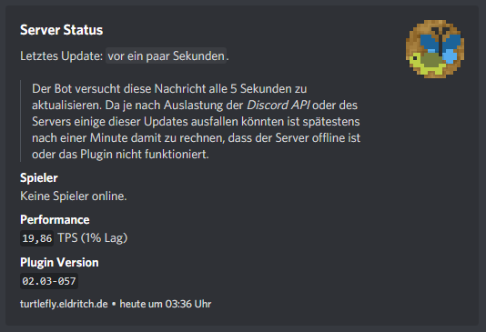
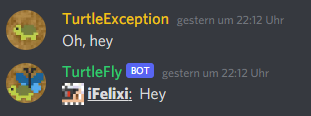
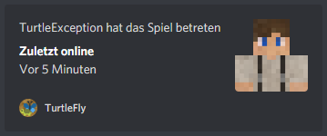

# TurtleFly


## Modules
The plugin is split into modules (`PluginModule`), which would have originally been independant plugins. Combining their functionality allows for smoother communication between modules to prevent working with spigots plugin-dependency system.
### Chat
A simple redesign of the ingame-chat as an alternative to the `Multiverse Core` prefix chat. This imroves readability and allows additional features like response-chat or hover-text.

(*see **SyncModule** for more*)
### Click
When a player clicks on another player particles are summoned around that second player. These can be customized via `/click` or with the config:
```yml
<player-UUID>:
  default:
    particle: NOTE
    message: "MiriJAM"
  <target-UUID>:
    particle: HEART
    message: "<3"
  <other-target-UUID>:
    ...
<other-player-UUID>:
  ...
```
### Compass (*not implemented*)
Much like the [lodestone](https://minecraft.fandom.com/wiki/Lodestone) in the vanilla game, players can function as compass targets too (even considering them moving around). A simple right-click on a player will set their location, which will be frequently updated, as the new compass target.

To remove the current player target use `/unbind`.
### Emote
Every time a player joins the server the Discord Guild will receive an updated version of their current avatar as an emote, which is retrieved via [this](https://minotar.net) API.
### Helmet
Allows player to wear certain items (mostly flowers) as helments, which must be placed by another player by right-clicking them with the item in their hand.
### Language
To provide translations for the DiscordAPI and other modules this module can retrieve a specific String in different languages from the language-files.
```java
// this will return "Ein Witz zum Wegwerfen"
LanguageModule.get("advancements.adventure.throw_trident.title", "de_de");
```
Please note that all language files must be manually placed in `./lang` in the plugin's data folder. In this case a file `de_de.json` must be provided.
### Pets (*not implemented*)
Sharing pets ingame is possible by simply taiming them and then using `/pet trust <PLAYERNAME>` while looking at that pet. If you want to completely share the pet with another person, who should have the same accesibilities as you, use `/pet share <PLAYERNAME>`, but note that the other player will also be able to limit these rights to themselves.
### Status
Regularily posts an embedded Message to a specific Discord channel that provides some status information on the server:


### Sync
Completely mirrors the minecraft chat and a specified channel on the Discord Guild:
 
### Update (*freezer*)
Allows for an easier plugin update without having to restart the server every time. This is especially useful for testing purposes so the server doesn't have to restart for every new build.